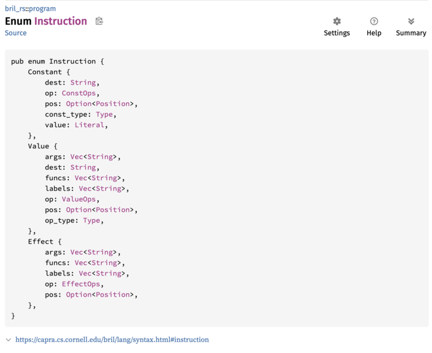

# Lab Notebook

- We manually ported [Adrian's flatcalc repo](https://github.com/sampsyo/flatcalc) from Rust to OCaml to better understand what it's doing ([OCaml repo](https://github.com/ngernest/ocaml_flatcalc))
- Rewriting the interpreter from scratch in OCaml was helpful, since the distinction between the `Expr` and `ExprRef` types (where the latter is an index into the arena of `Expr`s) becomes much more apparent when you have to get the code to typecheck in OCaml
- The key insight is that when we call `flat_interp` in the Rust code, the `root` parameter
(the `expr` we're passing to `flat_interp`) is actually an index (an `ExprRef`) to the final
element in the arena. This is because:
1. every time we parse a sub-expression, we call `ExprPool::add` to populate the arena from left to right, and
2.  we parse bottom-up (i.e. we have to create child `Expr`s before we create their parent)
These two factors combined mean that the top-level `Expr` (the final `Expr` the parser encounters) corresponds to the final element of the arena. 

To see this in action, I added print statements to [my fork](https://github.com/ngernest/flatcalc/tree/flat) of the Rust flatcalc repo to see how the arena is populated when we parse `5 * 2 + 1`:
```bash
$ echo "5 * 2 + 1" | cargo run flat_interp
Adding Literal(5) to pool
	pool = [Literal(5)], idx = 0
Adding Literal(2) to pool
	pool = [Literal(5), Literal(2)], idx = 1
Adding Binary(Mul, ExprRef(0), ExprRef(1)) to pool
	pool = [Literal(5), Literal(2), Binary(Mul, ExprRef(0), ExprRef(1))], idx = 2
Adding Literal(1) to pool
	pool = [Literal(5), Literal(2), Binary(Mul, ExprRef(0), ExprRef(1)), Literal(1)], idx = 3
Adding Binary(Add, ExprRef(2), ExprRef(3)) to pool
	pool = [Literal(5), Literal(2), Binary(Mul, ExprRef(0), ExprRef(1)), Literal(1), Binary(Add, ExprRef(2), ExprRef(3))], idx = 4

parsed expr = ((5 * 2) + 1)
Entering flat_interp:
root = ((5 * 2) + 1)
	setting state[0] = 5
	setting state[1] = 2
	setting state[2] = 10
	setting state[3] = 1
	setting state[4] = 11
final arena = [5, 2, 10, 1, 11]
final interpreted value = 11
```


## Related Work 
There's a series of papers about [Gibbon](https://iu-parfunc.github.io/gibbon/), a compiler which translates ASTs to flattened representations:
- [Compiling Tree Transforms to Operate on Packed Representations (ECOOP '17)](https://drops.dagstuhl.de/storage/00lipics/lipics-vol074-ecoop2017/LIPIcs.ECOOP.2017.26/LIPIcs.ECOOP.2017.26.pdf)
  - ^^ OG paper about compiling an AST for a functional language to a flattened representation
- [LoCal: A Language for Programs Operating on Serialized Data (PLDI '19)](https://dl.acm.org/doi/pdf/10.1145/3314221.3314631) 
  - ^^ follow-up work about add type-system and surface-language support for giving the user greater control over the flattened representation

- Note: these papers are about compiling a custom language to this flattened format, 
where the design of the language (e.g. the type system) makes it amenable to flattening.
- Challenge: how do we take an existing language (Bril) and flatten it? 

## Flattening Bril

When considering how we might apply the same ideas to Bril we are running into a few barriers:

1. It seems as though the ASTs we consider in Bril correspond to individual instructions (and these are not recursive) so each AST is small and so unlikely to be very deep. Maybe it is not even helpful to think in terms of ASTs for Bril since it is statements rather than expressions.
2. If it is the case that ASTs (or whatever it is we want to flatten) correspond to instructions, it seems that the representation of instructions in the Rust interpreter is already flat (as in the fields of an instruction are stored as data within the instruction in memory rather than as pointers to other regions of memory).



Although actually it seems that this may not be the case for fields with type Vec<X> or String, so maybe there is some work to be done for these fields to flatten them.

Additionally maybe we want to flatten at the level of an interpreter Program object, which is clearly not flat because it has pointer to functions and functions have pointers to instructions. It is currently unclear to us at what level we want to flatten (program, function, instruction etc.). Clearly flattening at a lower level is easier. 